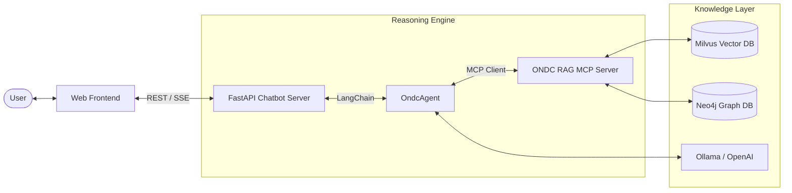

# ONDC Automation RAG Chatbot


[](https://fastapi.tiangolo.com/)
[](https://www.langchain.com/)
[](https://modelcontextprotocol.io/)

The **ONDC Automation RAG Chatbot** is a state-of-the-art conversational interface designed to help developers and stakeholders navigate the complex **ONDC (Open Network for Digital Commerce)** specifications. It uses Retrieval-Augmented Generation (RAG) combined with the **Model Context Protocol (MCP)** to provide accurate, real-time, and context-aware responses.

---

## ✨ Key Features

- **🌊 Real-time Streaming**: Utilizes Server-Sent Events (SSE) to stream model "thoughts" and content response as they are generated.
- **🛠️ Tool-Augmented Retrieval**: Integrated with the ONDC RAG MCP Server to perform semantic (Milvus) and structural (Neo4j) searches.
- **🌓 Hybrid Database Modes**:
  - **Milvus Mode**: Pure semantic search over documentation.
  - **Neo4j Mode**: Focus on structural rules, API actions, and validation logic.
  - **Hybrid Mode**: Combines the best of both worlds for comprehensive answers.
- **💾 Session Management**: Maintains conversation state and history for multi-turn reasoning.
- **🎨 Modern Web UI**: A clean, responsive interface for interacting with the ONDC knowledge base.

---

## 🏗️ Architecture



---

## 🚀 Getting Started

### 1. Prerequisites

- **Python 3.12+**
- **uv** (Package manager)
- **Docker & Docker Compose**
- A running instance of the [ONDC RAG MCP Server](../automation-rag-mcp/README.md).

### 2. Configuration

Create a `.env` file in the root directory:

```env
# Server
HOST=0.0.0.0
PORT=8000

# MCP Integration
MCP_SERVER_URL=http://localhost:8004/sse

# LLM Selection
# For Ollama (Local)
OLLAMA_BASE_URL=http://localhost:11434
GENERATION_MODEL=qwen2.5-coder:7b

# For OpenAI (Cloud)
# OPENAI_API_KEY=sk-...
# GENERATION_MODEL=gpt-4o

# ONDC Defaults
DEFAULT_DOMAIN=ONDC:FIS12
DEFAULT_API_VERSION=2.3.0
LOG_LEVEL=INFO
```

### 3. Running the App

#### Local Development

```bash
# Install dependencies
uv sync

# Run the backend
uv run python main.py
```

Visit `http://localhost:8000` to start chatting!

#### Docker Deployment

```bash
# Ensure the external network exists
docker network create rag_network || true

# Start the chatbot
docker compose up --build
```

---

## 🛠️ Technical Stack

- **Backend**: [FastAPI](https://fastapi.tiangolo.com/) for high-performance async API and SSE.
- **Orchestration**: [LangChain](https://python.langchain.com/) for agentic reasoning and tool binding.
- **Protocol**: [Model Context Protocol (MCP)](https://modelcontextprotocol.io/) for standardized database tool access.
- **Frontend**: Vanilla JS/CSS for a lightweight and responsive UI.

---

## 📄 License

This project is part of the ONDC Automation Suite. Refer to the root repository for licensing information.
